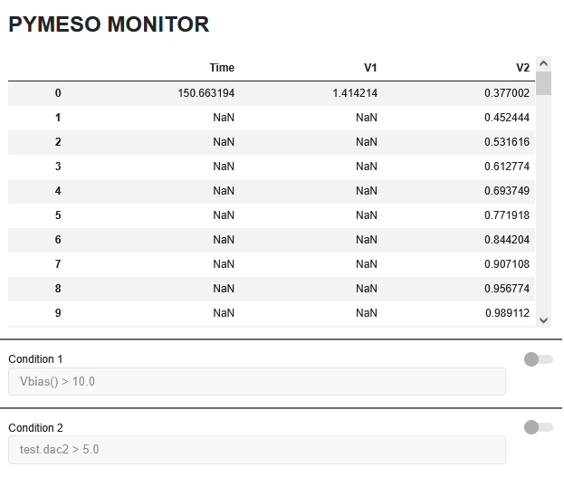
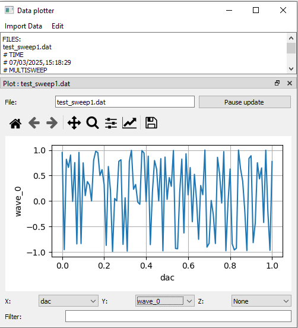
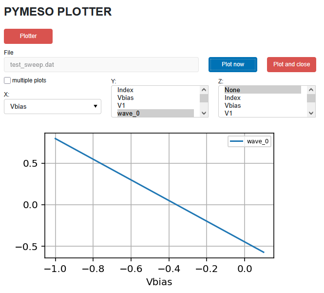
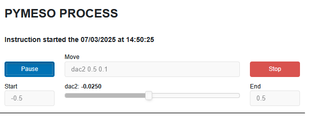
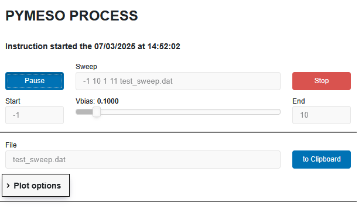
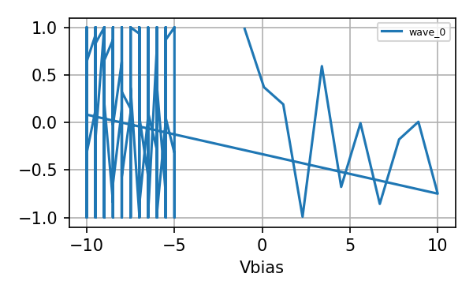
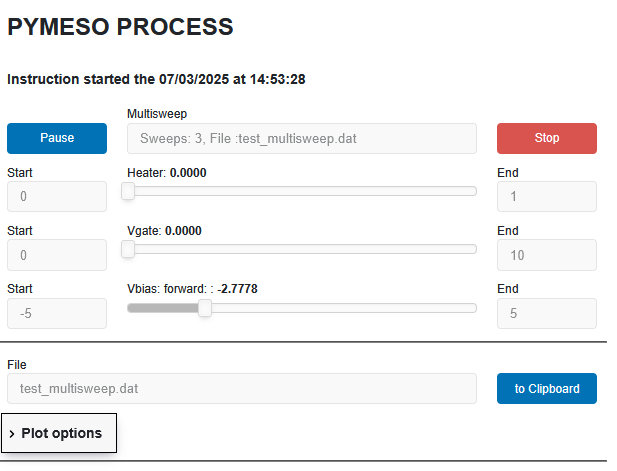
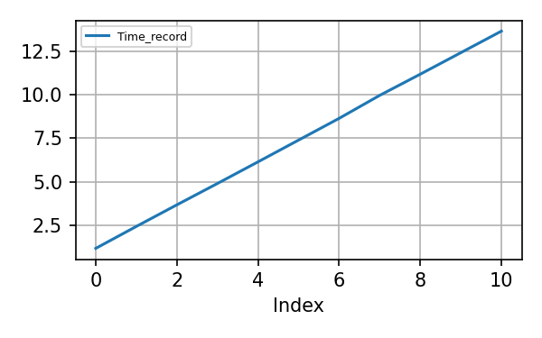
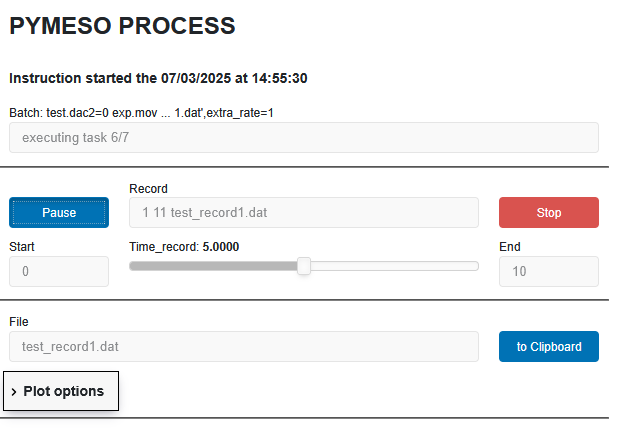

# pymeso

Pymeso is a python package for instrument control, experiment execution and data acquisition. It is intended to be used in a jupyter lab/notebook. 

In addition to standard modules such as numpy, pandas and matplotlib, it relies on the following modules: pyvisa, pyserial, pyperclip, panel.
If matrix chat software is used for automated warning, the package nio is also required. 

# Tutorial

## Initialization

### Load the Experiment module

This module contains the methodes used to carry an experiment. In this tutorial it will be called 'exp'.  
The panel of the module is accessible at the adress http://localhost:PORT  
where PORT can be defined by the user (default value 5009).  

This panel has three apps :  
- "Process" to display the running processes
- "Plotter" to help plotting data in the notebook or launch an external plotter
- "Monitor" to monitor and check values of a given list of devices.


```python
from pymeso import Experiment
exp = Experiment()
```


Pymeso panel at [http://localhost:5009](http://localhost:5009/) <br> Logfile is experiment_logfile.log


The data file are by default saved in the current directory. A another directory can be specified using the path parameter. 
The path attribute can also be changed.


```python
exp.path
```


    './'


### Load some useful modules

Load some utilities for the experiment, that will be used later :  
- different type of sweeps :
  * linear sweep : LinSweep
  * linear sweep for on the fly measurement : FlySweep
  * Steps with linear increase : LinSteps
  * Steps with log increase : LogSteps
  * Steps of arbitratry value : ArraySteps
- Alias : used to refer to intrument attributes that are often called
- Ampli : to define a new instrument based on the value of another one


```python
from pymeso.utils import LinSweep,LinSteps,LogSteps,ArraySteps,FlySweep
from pymeso.utils import Alias
from pymeso.instruments.utils import Ampli
```

### Load drivers for instruments

The instruments driver are very similar to the ones developped in the pymeasure package. 

We first load the generic driver for a type of instrument and then create one particular instrument with a given address (uncomment lines if you want to load the corresponding instrument).


```python
# Fake instruments used for this tutorial
from pymeso.instruments.utils import Dummy
test=Dummy()
test2=Dummy()

### Lakeshore AC bridge
# from pymeso.instruments.lakeshore import LakeShore372
# temp=LakeShore372('COM4')

### SRS SR830 Lock-in amplifiers
# from pymeso.instruments.srs import SR830
# sr1=SR830(9) # GPIB adress 9
# sr2=SR830(10)
# sr3=SR830(11)
# sr4=SR830(12)

### YOKOGAWA DC source 
# from pymeso.instruments.yokogawa import GS200
# yoko=GS200(19)
# from pymeso.instruments.yokogawa import GS610
# yokofield=GS610(3)
```

### Remarks on instruments drivers

The pymeso experiment module will read and set intruments attribute.

The **checking** dictionnary of the instrument class allow to check the range of given attributes.
The dictionnary should return a boolean function for each tested attribute.  
example :   
self.checking={}  
self.checking['sine_voltage']=lambda x: (x>=0.004) & (x<=5)  
self.checking['frequency']=lambda x: (x>=0.001) & (x<=102000)  

If defined the function **read_config** will return a dictionnary with useful information that will be written in the header of the data file.  

        

## Configuration of the experiment

### Define aliases for some instrument attribute
This is used to refer to intrument attributes that are often called. Here we will refer to 
- test.dac as Vbias 
- test.dac2 as Vgate 

If name is indicated it will be used as a label in the data file. Otherwise the name of the attribute is used.


```python
Vbias=Alias([test,'dac'],name='Vbias')
Vgate=Alias([test,'dac2'],name='Vgate')
```

Get Alias value


```python
Vbias()
```


    0


Set Alias value


```python
Vbias(3.14)
```


```python
Vbias()
```


    3.14


### Define a new instrument based on the value of another one


```python
Vbias_mV=Ampli(Vbias,1000) #gain of 1000
Vgate_kV=Ampli([test,'dac2'],1e-3)  # gain of 0.001
Vbias_2_instru=Ampli(Vbias,lambda x:x**2,lambda x:x**0.5) # function and its inverse function
```


```python
Vbias(2.5)
Vbias_mV.value
```


    2500.0


```python
Vbias_mV.value=50
Vbias()
```


    0.05


```python
Vbias(3.0)
Vbias_2_instru.value
```


    9.0


```python
Vbias_2_instru.value=2.0
Vbias()
```


    1.4142135623730951


### Define the instruments that are measured in an experiment

This is define in the form of a python dictionnary of the form {'label':instrus, ...} where :
- 'label' will be the name of the corresponding data in the file
- instrus is the measured attribute of an instrument. It can have different forms :
    - 'instru' if 'instru' has been defined as an alias (see before)
    - [instru,'attribute'] to measure instru.attribute
    - (instru,'attribute') to measure instru.attribute


```python
exp.measure={'V1':Vbias,
              'wave':[test2,'wave'],
              'V2':[test,'dac2'],
              'wave5':[test2,'wave5'],
              'V3':(test2,'dac3'),
              'Time':[test,'time'],
              'wave10':[test,'wave10']}
```

One can get the measurement by using get_measure, and, if indicated, save it to a file.


```python
exp.get_measure(format='col_multi',file='test_file.dat',comment='Test comment')
```


<div>
<style scoped>
    .dataframe tbody tr th:only-of-type {
        vertical-align: middle;
    }

    .dataframe tbody tr th {
        vertical-align: top;
    }

    .dataframe thead th {
        text-align: right;
    }
</style>
<table border="1" class="dataframe">
  <thead>
    <tr style="text-align: right;">
      <th></th>
      <th>V1</th>
      <th>wave</th>
      <th>V2</th>
      <th>wave5</th>
      <th>V3</th>
      <th>Time</th>
      <th>wave10</th>
    </tr>
  </thead>
  <tbody>
    <tr>
      <th>0</th>
      <td>1.414214</td>
      <td>-0.046085</td>
      <td>0</td>
      <td>0.370041</td>
      <td>0</td>
      <td>36.611864</td>
      <td>0.354483</td>
    </tr>
    <tr>
      <th>1</th>
      <td>1.414214</td>
      <td>0.271480</td>
      <td>0</td>
      <td>-0.968617</td>
      <td>0</td>
      <td>36.611864</td>
      <td>0.992874</td>
    </tr>
    <tr>
      <th>2</th>
      <td>1.414214</td>
      <td>0.567955</td>
      <td>0</td>
      <td>-0.450161</td>
      <td>0</td>
      <td>36.611864</td>
      <td>-0.752152</td>
    </tr>
    <tr>
      <th>3</th>
      <td>1.414214</td>
      <td>0.808244</td>
      <td>0</td>
      <td>-0.820720</td>
      <td>0</td>
      <td>36.611864</td>
      <td>0.834469</td>
    </tr>
    <tr>
      <th>4</th>
      <td>1.414214</td>
      <td>0.959821</td>
      <td>0</td>
      <td>-0.328595</td>
      <td>0</td>
      <td>36.611864</td>
      <td>-0.864322</td>
    </tr>
    <tr>
      <th>...</th>
      <td>...</td>
      <td>...</td>
      <td>...</td>
      <td>...</td>
      <td>...</td>
      <td>...</td>
      <td>...</td>
    </tr>
    <tr>
      <th>95</th>
      <td>1.414214</td>
      <td>-0.433680</td>
      <td>0</td>
      <td>NaN</td>
      <td>0</td>
      <td>36.611864</td>
      <td>NaN</td>
    </tr>
    <tr>
      <th>96</th>
      <td>1.414214</td>
      <td>-0.999357</td>
      <td>0</td>
      <td>NaN</td>
      <td>0</td>
      <td>36.611864</td>
      <td>NaN</td>
    </tr>
    <tr>
      <th>97</th>
      <td>1.414214</td>
      <td>-0.490148</td>
      <td>0</td>
      <td>NaN</td>
      <td>0</td>
      <td>36.611864</td>
      <td>NaN</td>
    </tr>
    <tr>
      <th>98</th>
      <td>1.414214</td>
      <td>0.556531</td>
      <td>0</td>
      <td>NaN</td>
      <td>0</td>
      <td>36.611864</td>
      <td>NaN</td>
    </tr>
    <tr>
      <th>99</th>
      <td>1.414214</td>
      <td>0.991571</td>
      <td>0</td>
      <td>NaN</td>
      <td>0</td>
      <td>36.611864</td>
      <td>NaN</td>
    </tr>
  </tbody>
</table>
<p>100 rows × 7 columns</p>
</div>


Another measurement can be appended to the same file.


```python
exp.get_measure(format='col_multi',file='test_file.dat',append=True)
```


<div>
<style scoped>
    .dataframe tbody tr th:only-of-type {
        vertical-align: middle;
    }

    .dataframe tbody tr th {
        vertical-align: top;
    }

    .dataframe thead th {
        text-align: right;
    }
</style>
<table border="1" class="dataframe">
  <thead>
    <tr style="text-align: right;">
      <th></th>
      <th>V1</th>
      <th>wave</th>
      <th>V2</th>
      <th>wave5</th>
      <th>V3</th>
      <th>Time</th>
      <th>wave10</th>
    </tr>
  </thead>
  <tbody>
    <tr>
      <th>0</th>
      <td>1.414214</td>
      <td>-0.041878</td>
      <td>0</td>
      <td>-0.793798</td>
      <td>0</td>
      <td>43.149783</td>
      <td>0.830436</td>
    </tr>
    <tr>
      <th>1</th>
      <td>1.414214</td>
      <td>0.275634</td>
      <td>0</td>
      <td>0.284716</td>
      <td>0</td>
      <td>43.149783</td>
      <td>-0.868894</td>
    </tr>
    <tr>
      <th>2</th>
      <td>1.414214</td>
      <td>0.571592</td>
      <td>0</td>
      <td>0.993141</td>
      <td>0</td>
      <td>43.149783</td>
      <td>-0.857582</td>
    </tr>
    <tr>
      <th>3</th>
      <td>1.414214</td>
      <td>0.810905</td>
      <td>0</td>
      <td>0.955134</td>
      <td>0</td>
      <td>43.149783</td>
      <td>-0.811811</td>
    </tr>
    <tr>
      <th>4</th>
      <td>1.414214</td>
      <td>0.961113</td>
      <td>0</td>
      <td>-0.258785</td>
      <td>0</td>
      <td>43.149783</td>
      <td>-0.964323</td>
    </tr>
    <tr>
      <th>...</th>
      <td>...</td>
      <td>...</td>
      <td>...</td>
      <td>...</td>
      <td>...</td>
      <td>...</td>
      <td>...</td>
    </tr>
    <tr>
      <th>95</th>
      <td>1.414214</td>
      <td>-0.446590</td>
      <td>0</td>
      <td>NaN</td>
      <td>0</td>
      <td>43.149783</td>
      <td>NaN</td>
    </tr>
    <tr>
      <th>96</th>
      <td>1.414214</td>
      <td>-0.999771</td>
      <td>0</td>
      <td>NaN</td>
      <td>0</td>
      <td>43.149783</td>
      <td>NaN</td>
    </tr>
    <tr>
      <th>97</th>
      <td>1.414214</td>
      <td>-0.477377</td>
      <td>0</td>
      <td>NaN</td>
      <td>0</td>
      <td>43.149783</td>
      <td>NaN</td>
    </tr>
    <tr>
      <th>98</th>
      <td>1.414214</td>
      <td>0.568683</td>
      <td>0</td>
      <td>NaN</td>
      <td>0</td>
      <td>43.149783</td>
      <td>NaN</td>
    </tr>
    <tr>
      <th>99</th>
      <td>1.414214</td>
      <td>0.989544</td>
      <td>0</td>
      <td>NaN</td>
      <td>0</td>
      <td>43.149783</td>
      <td>NaN</td>
    </tr>
  </tbody>
</table>
<p>100 rows × 7 columns</p>
</div>


### Define default timing for the experiment

Change values of the timing options used in the experiment :
- init_wait : waiting time at the beginning of a sweep, in second
- wait_time : waiting time before taking one measurement, in second


```python
exp.wait_time=0.2
exp.init_wait=1
```

## Monitoring and checking

These functions are shown in the Monitor app of the Pymeso Panel. 

*Interface of the monitor and check functions available in the Monitor panel:*  


### Monitor some values periodically


```python
exp.monitor={'Time':[test,'time'],'V1':Vbias,'V2':[test,'wave']}
```

#### Change the format of the monitored data : 
Format can be :  
- 'line' : tabular data are put in line with label _n for the nth element
- 'line_multi': tabular data are put in line with a second index (see pandas) 
- 'col' : tabular data are put in columns with no number to fill the empty place
- 'col_multi' : tabular data are put in columns with duplicated numbers to fill the empty place


```python
exp.monitor_format='col'
```

### Check a list of conditions


```python
exp.check=['Vbias() > 10.0', 'test.dac2 > 5.0']
```

#### Define a warning procedure to send a message by email

Uncomment line and put the correct STMP and email settings for your needs. 


```python
from pymeso.instruments.utils import Mail_Sender
# mailer=Mail_Sender('smtp.aaa.aa',43,experiment='Experiment')
# mailer.notify_list=['aa.bb@aaa.aa']
```

#### Define a warning procedure to send a message by matrix

Uncomment line and put the correct matrix identifier for your needs.


```python
from pymeso.instruments.utils.matrix_sender import Matrix_Sender
# sender=Matrix_Sender(user='USER',experiment='EXPERIMENT')
```

#### define the check_warning list


```python
# exp.check_warning=[sender.notify,mailer.notify]
```

#### test checked conditions


```python
test.dac2=11.3
Vbias(14.5)
```

# To do the experiment

## Inline or Batch execution

The different methods of the experiment modules can be executed :
- in a Jupyter cell. In this case the instruction is executed in a different thread. It means that the user car execute other instructions during the execution of the first instruction.
- from a file (using exp.batch_file('filename')) or a multiline string (using exp.batch_line(multiline_string)). The batch format has the following properties :
    - the empty lines or the lines starting by % or # are ignored
    - the instructions will be executed sequentially

Note that the batch is executed in a different thread. The option run=False in batch_line or batch_file return the list of instructions without executing them.
Some examples of batch execution are given at the end of this notebook.

## Locking mechanism

The Experiment module has a locking mechanism to prevent changing the same instrument's attribute with two different instructions. In case of problem with this locking mechanism, one can reset it by using the instruction:


```python
exp.clear_lock()
```

## List of methods in Experiment module:
- move
- sweep
- multisweep
- record
- wait
- spy
- plot

## Plotting the data 

### External plotter

During or after taking the data, one can plot them with the external plotter. You can start the plotter with the plot button in the Plotter panel. It launches the python program plot_exec.py (or plot_exec.pyw under windows if you don't want to see a terminal window) in the utils directory.

*Window of the external plotter:*  


## Plot data in the notebook

You can also plot data in the notebook using the plot method of the Experiment module :

**Syntax:** exp.plot('file')

Plot data from file in a Jupyter notebook cell.  
The choice of settings for plotting is done in the Plotter panel.

*Interface of the plot function opened in the Plotter panel:*  



```python
exp.plot('test_sweep.dat')
```


    

    


# Available methods

## Move

**Syntax:** exp.move(device, value, rate)

Used to move an instrument attribute 'device' to a given value at a given rate.  

The device can be indicated in different forms :
- 'device', if this is defined as an alias
- [instru,'attribute'] to move instru.attribute
- (instru,'attribute') to move instru.attribute
- {'label':[instru,'attribute']} to move instru.attribute

During execution the following window is available in the Process Panel :  



```python
test.dac2=-0.5
exp.move([test,'dac2'],0.5,0.1)
```


**Task done the 07/03/2025 at 15:41:46 :** <br>Move dac2 0.5 0.1


```python
test.dac=0
exp.move(Vbias,1,0.1)
```


**Task done the 07/03/2025 at 15:42:01 :** <br>Move Vbias 1 0.1


```python
test.dac=0
exp.move({'Vbias':[test,'dac']},1,0.1)
```


**Task done the 05/02/2025 at 16:53:56 :** <br>Move Vbias 1 0.1


To get help you can ask for inline help 


```python
exp.move?
```

## Sweep

**Syntax** : exp.sweep(device,start,end,rate,Npoints,file)  

Sweep the device defined in 'device' from 'start' to 'end' 
at a rate 'rate' with 'Npoints' points and save measured data to the file 'file'. 
If the  file extension is .gz, .bz2 or .xz, the file is automatically 
compressed with the corresponding algorithm.

The device can be indicated in different forms :
- 'device', if this is defined as an alias. The label in the file will be 'device'.
- [instru,'attribute'] to move instru.attribute. The label in the file will be 'instru'.
- (instru,'attribute') to move instru.attribute. The label in the file will be 'instru'.
- {'label':[instru,'attribute']} to move instru.attribute. The label in the file will be 'label'.

**Options** :
- extra-rate : rate used outside the main loop. If None then set to rate. Default : None
- wait : if True, wait the wait_time before doing the measurement. Default : True
- back : If True, return to the start value when finished. Default : False.
- fly : if True use on the fly measurement. Default : False
- mode : define the mode of the sweep. Default : None
    * None : standard sweep
    * serpentine : alternate forward and backwards for successive stepper
    * updn : do a forward and then a backward sweep
- overwrite : If True overwrite the file, otherwise the old file is renamed. Default : False
- format : format of the data (line, line_multi, col, col_multi). Default : line
    - 'line' : tabular data are put in line with label _n for the nth element
    - 'line_multi': tabular data are put in line with a second index
    - 'col' : tabular data are put in columns with no number to fill the empty place
    - 'col_multi' : tabular data are put in columns with duplicated numbers to fill the empty place
- init_wait : value of the time waited at the beginning of the sweep, if None set to self.init_wait. Default : None
- wait_time : value of the time waited before each measurement, if None set to self.wait_time. Default : None
- measure : specify the measured quantities in the form of a python dict. if None set to self.measure. Default : None
- comment : add the comment provided by the user to the header of the file
- append : append value to an existing files without putting column label. Default : False

During execution the following window is available in the Process Panel :  



```python
#measure_dict={'V1':[test,'dac'],'wave':'test2.wave',
#              'V2':[test,'dac2'],'V3':[test,'dac3'],'Time':[test,'time']}
#exp.measure=measure_dict
exp.measure
exp.wait_time=2
exp.init_wait=1
test.dac=0
comment_text='This is a comment for the headre of the file'
exp.sweep(Vbias,-1,10,1,11,'test_sweep.dat',comment=comment_text)
```


**Task done the 07/03/2025 at 14:52:43 :** <br>Stopped, Sweep -1 10 1 11 test_sweep.dat


Another measurement can appended to the same file, using the parameter append=True


```python
exp.sweep(Vbias,-10,-5,0.1,11,'test_sweep.dat',
          mode='updn',init_wait=5,extra_rate=1,format='col_multi',append=True)
```


**Task done the 05/02/2025 at 16:58:12 :** <br>Sweep -10 -5 0.1 11 test_sweep.dat


    

    


A sweep with measurement on the fly is possible with the option fly=True


```python
exp.sweep(Vbias,-1,10,1,11,'test_sweep_fly.dat',comment=comment_text,fly=True)
```


**Task done the 07/03/2025 at 14:53:08 :** <br>Sweep -1 10 1 11 test_sweep_fly.dat


To get help you can ask for inline help


```python
exp.sweep?
```

## Multisweep

**SYNTAX:** exp.multisweep(stepper_list,file)

Multi-sweep using a list of sweeps defined in stepper_list and save it to a file 'file'. If the file extension is .gz, .bz2 or .xz, the file is automatically compressed with the corresponding algorithm.

The stepper_list has the forms [sweep0,sweep1,...] where sweep0,sweep1,...
are sweeps of type LinSweeps, FlySweep, LinSteps, LogSteps, ArraySteps.

**OPTIONS:**
- overwrite : If True overwrites the file, otherwise the old file is renamed. Default : False
- format : format of the data (line, line_multi, col, col_multi). Default : line
    - 'line' : tabular data are put in line with label _n for the nth element
    - 'line_multi': tabular data are put in line with a second index
    - 'col' : tabular data are put in columns with no number to fill the empty place
    - 'col_multi' : tabular data are put in columns with duplicated numbers to fill the empty place
- measure : specify the measured quantities in the form of a python dict. if None set to self.measure. Default : None
- wait_time : value of the time waited before each mesurement, if None set to self.wait_time. Default : None
- wait : if True, wait the wait_time before doing the measurement. Default : True
- comment : add the comment provided by the user to the header of the file
- append : append value to an existing files without putting column label. Default : False

During execution the following window is available in the Process Panel:  



```python
exp.measure={'Vbias1':Vbias,
              'wave':[test2,'wave'],
              'V2':[test,'dac2'],
              'V3':(test2,'dac3'),
              'Time':[test,'time'],
              'wave10':[test,'wave10']}
step_heater=LinSteps([test,'dac3'],0,1,5,1,name='Heater')
sweep_gate=LinSweep([test,'dac'],0,10,2,10,name='Vgate')
sweep_bias=LinSweep([test,'dac2'],-5,5,2,10,name='Vbias',mode='serpentine')
exp.multisweep([step_heater,sweep_gate,sweep_bias],'test_multisweep.dat',overwrite=True,
               comment="comment")
```


**Task done the 07/03/2025 at 14:54:26 :** <br>Stopped, Multisweep Sweeps: 3, File :test_multisweep.dat


To get help you can ask for inline help:


```python
exp.multisweep?
```

## Record

**Syntax :** exp.record(time_interval,npoints,file)

Record data every time_interval (in seconds) with npoints points in the file 'file'.
If the  file extension is .gz, .bz2 or .xz, the file is automatically compressed with the corresponding algorithm.

**Options** :
- overwrite : If True overwrite the file, otherwise the old file is renamed. Default : False
- format : format of the data (line, line_multi, col, col_multi). Default : line
    - 'line' : tabular data are put in line with label _n for the nth element
    - 'line_multi': tabular data are put in line with a second index
    - 'col' : tabular data are put in columns with no number to fill the empty place
    - 'col_multi' : tabular data are put in columns with duplicated numbers to fill the empty place
- measure : specify the measured quantities in the form of a python dict. if None set to self.measure. Default : None
- comment : add the comment provided by the user to the header of the file
- append : append value to an existing files without putting column label. Default : False


```python
measure_dict={'V1':[test,'dac']}
exp.record(1,11,'test_record1.dat',format='col_multi',measure=measure_dict)
```


**Task done the 05/02/2025 at 17:04:11 :** <br>Record 1 11 test_record1.dat


    

    


To get help you can ask for inline help:


```python
exp.record?
```

## Wait

Wait during the time 'value' (in seconds) or until the condition 'value' (described by a string) is fulfilled.

Example of a 10-second wait:


```python
exp.wait(10)
```


**Task done the 07/03/2025 at 14:55:37 :** <br>Wait finished


Example of a waiting condition:


```python
test.dac2=0
exp.wait('test.dac2 > 2')
```


**Task done the 05/02/2025 at 17:28:54 :** <br>Wait finished


```python
test.dac2=3
```

To get help you can ask for inline help:


```python
exp.wait?
```

## Spy

**Syntax:** exp.spy(measure)

Launch a spy panel in the Process panel. The spied quantities are given in the measure dictionnary.
If no dictionnary is provided, exp.measure dictionnary is used.


```python
measure_dict={
    'V1':[test,'dac'],
    'wave':[test,'wave'],
    'V2':[test,'dac2'],
    'V3':[test,'dac3'],
    'Time':[test,'time']
}
exp.spy(measure_dict)
```


**Task done the 05/02/2025 at 17:30:07 :** <br>Spy


To get help you can ask for inline help:


```python
exp.spy?
```

## Batch_line

**Syntax:** exp.batch_line(instructions)

Execute sequentially the instructions listed in the multiline string 'instructions'. See examples below.

## Batch_file

**Syntax:** exp.batch_file(file)

Execute sequentially the instructions listed in the file. See examples below.

# Examples of batch 

During execution of the batch, the following interface is available in the Process panel:  



```python
string="""
test.dac2=0
exp.move([test,'dac2'],1,0.1)
exp.wait_time=0.1
exp.init_wait=1
exp.wait(10)
exp.record(1,11,'test_record1.dat',format='col_multi')
exp.sweep([test,'dac'],0,1,0.1,101,'test_sweep1.dat',extra_rate=1)"""
exp.batch_line(string)
```


**Task done the 07/03/2025 at 15:53:14 :** <br>Batch:
test.dac2=0
exp.mov ... 1.dat',extra_rate=1


Same with a file:


```python
exp.batch_file('test_for_batch.txt')
```


**Task done the 05/02/2025 at 17:32:04 :** <br>Batch:test_for_batch.txt


Another example of batch list:


```python
# define Aliases
Vbias=Alias([test,'dac'],name='Vbias')
Vgate=Alias([test,'dac2'],name='Vgate')

# define measure quantities
exp.measure={'Vbias2':Vbias,'Vgate3':[test,'dac2'],
              'Vbias2':(test2,'dac3'),'Time':[test,'time']}

# define sweeps
sweep_gate=LinSteps(Vgate,0,1,11,0.1,init_wait=1)
sweep_bias=LinSweep(Vbias,-2,2,0.5,21,mode='updn',init_wait=0.5)

# define waiting_time
exp.wait_time=0.1

# define and start batch
string="""
exp.multisweep([sweep_gate,sweep_bias],'test_multisweep.dat',overwrite=True)
exp.move(Vgate,0,1)
"""
exp.batch_line(string)
```


**Task done the 05/02/2025 at 17:33:07 :** <br>Batch:
exp.multisweep([swe ... exp.move(Vgate,0,1)


